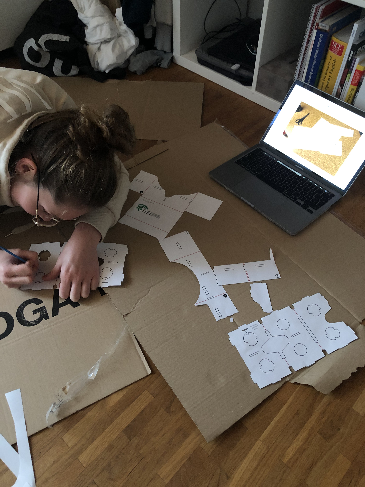
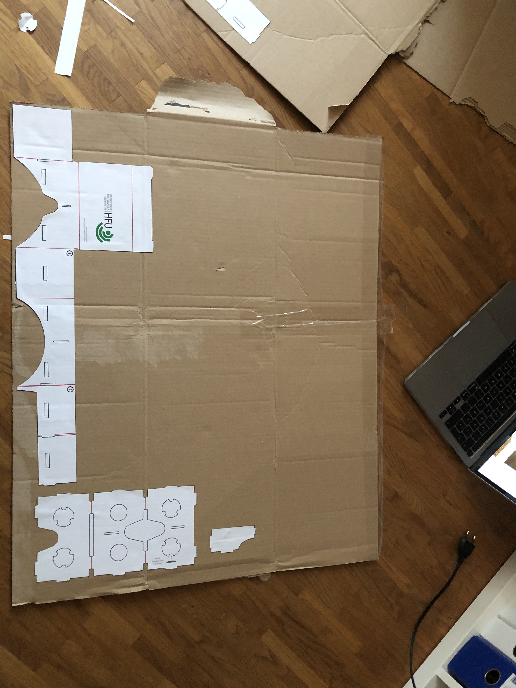
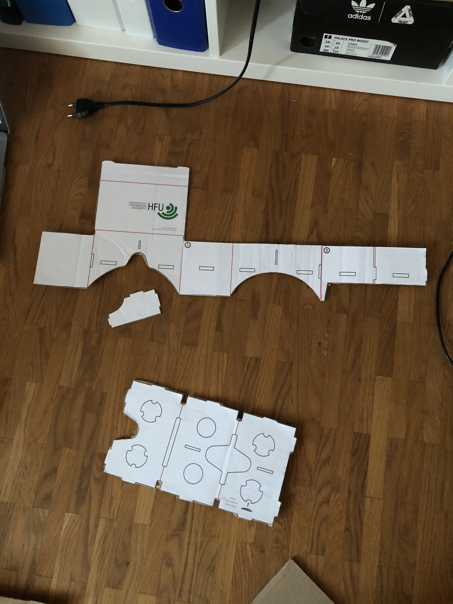
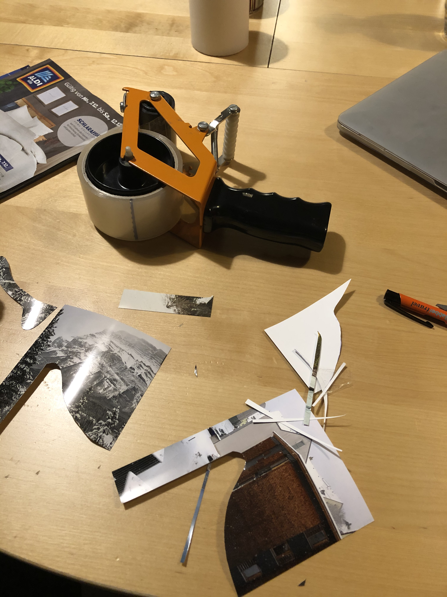
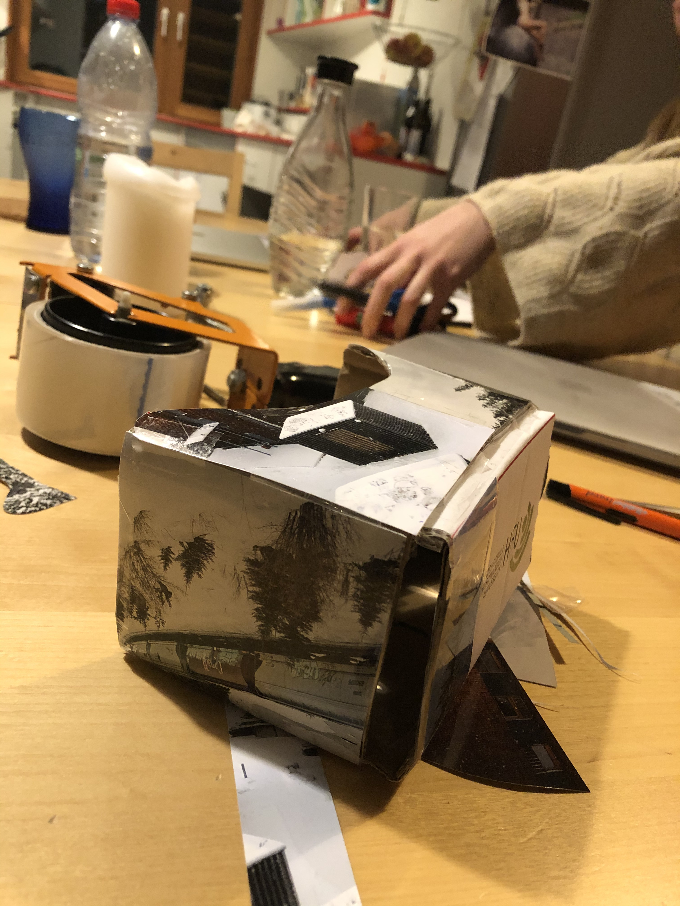
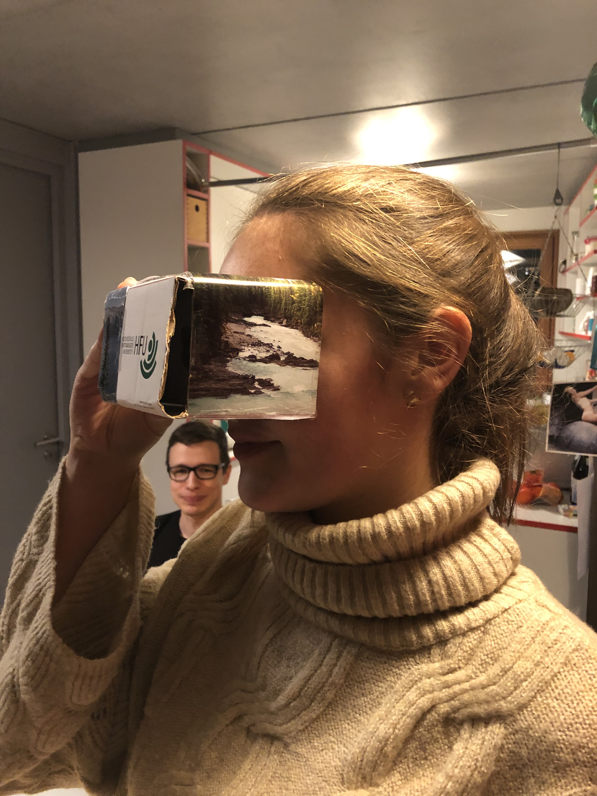

# Aufgabe 6: Mixed Reality - VR-Brille

erstellt von [Patrick Neudert](https://github.com/Patrickneudert)
## Schritt 1: Ausschneiden der Vorlage

## Schritt 2: Vorlage auf dickes Kartonage kleben

## Schritt 3: Ausschneiden der Vorlage auf dickem Kartonage

## Schritt 4: Ausschneiden der Bilder

## Schritt 5: Vorlage zusammenstecken

## Schritt 6: Test der Funktionalität der VR-Brille an Pia

